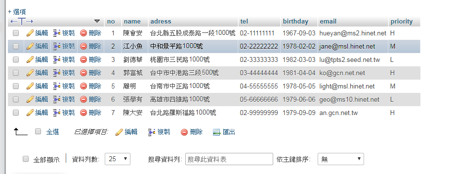
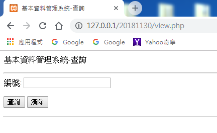
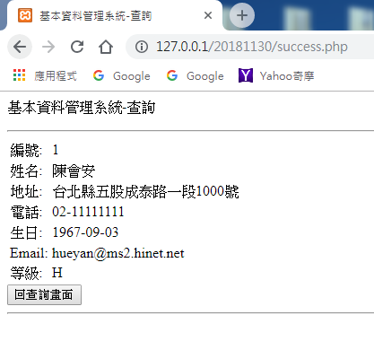
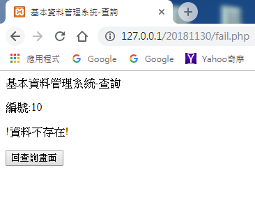

# PHP_SQL_Query_Tutorial
The tutorial is about SQL database basic operations in php. 

* view.php 為使用者介面
* controller.php 負責處理使用者傳入參數
* success.php 為成功查詢之畫面
* fail.php 為查詢失敗之畫面

下載後，需要將testdb.sql檔匯入(下圖為testdb資料庫中的users資料表內容)  
 

* view.php畫面，可以輸入數字(1~7)查詢資料  
   
* success.php畫面  
   
* fail.php畫面(因為只有7筆資料，10大於7所以找不到資料)  
   

